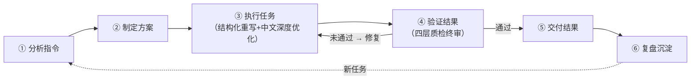

# 李白.Skill:润色专家
> **适用场景**: 自媒体文章、公关稿件、日常沟通、学术随笔等中文文本的去AI化改写
> **安全声明**: 本技能仅优化表达形式，不对原文事实准确性负责。涉及医疗、法律、金融等专业内容，请务必人工复核。
> **触发条件**: 当用户提及以下任意关键词时激活本技能——去AI味、去AI痕迹、AI润色、改写、润色、降AI、人味、人味注入、去机器味、deai、humanize、文章润色、文本润色、AI改写；或当用户表达"让这段文字读起来更像人写的""去掉机器翻译感""降低AI检测率"等去AI化意图时激活。

---


---

## 术语定义表

> 本表统一技能包内所有文件（SKILL.md、banned-words.md、zh_rules.json、各脚本注释）中使用的核心术语，消除"AI味/AI痕迹/AI口癖"等表述的歧义。

| 术语 | 英文对应 | 定义 | 来源/覆盖范围 |
| :--- | :--- | :--- | :--- |
| **AI痕迹** | AI Artifacts | 统称：文本中可被识别为AI生成的所有特征的总和。等于 AI味 + AI行话 + AI口癖 + 结构模板 | SKILL.md 父术语 |
| **AI味** | AI Flavor | 狭义：AI生成文本在**语气和流畅度**层面给人"不像人写"的感觉（如过度礼貌、回避冲突、温度恒定） | SKILL.md / banned-words.md |
| **AI行话** | AI Jargon | AI高频使用但人类不常用的**词汇和短语**（如"此外""赋能""总而言之"），对应 `zh_rules.json` 的 `ai_jargon` 字段 | zh_rules.json → RuleSet.ai_jargon |
| **AI口癖** | AI Verbal Tics | AI特有的**句式习惯**（如"值得注意的是…""需要指出的是…"），对应 `zh_rules.json` 的 `chatbot_artifacts` + `replacements` 中删除类键值 | zh_rules.json → RuleSet.chatbot_artifacts |
| **AI专属客套词** | AI Politeness Markers | AI过度使用的**礼貌性和服务性用语**（如"希望这对您有帮助""如有任何问题请随时联系"），属于 chatbot_artifacts 的子集 | zh_rules.json → RuleSet.chatbot_artifacts |
| **虚假升华** | False Sublimation | AI倾向在结尾进行拔高/总结/展望（如"总而言之""展望未来"），对应 `zh_rules.json` 的 `false_sublimation` 和 `replacements` 的结尾清理规则 | SKILL.md / zh_rules.json |
| **禁用词** | Banned Words | 需要被检测并标记的AI高频词汇（检测维度），以及需要被替换/删除的AI套话（改写维度）。两者的并集 | banned-words.md（检测） + zh_rules.json.replacements（改写） |
| **夸大性短语** | Puffery Phrases | AI倾向使用的过度修辞（如"具有重要意义""不可或缺"），对应 `zh_rules.json` 的 `puffery_phrases` 字段 | zh_rules.json → RuleSet.puffery_phrases |
| **模糊归因** | Vague Attributions | AI为避免责任使用的模糊来源表述（如"研究表明""有专家认为"），对应 `zh_rules.json` 的 `vague_attributions` | zh_rules.json → RuleSet.vague_attributions |
| **模棱两可表达** | Hedging Phrases | AI的过度谨慎表述（如"在某种程度上""可能"），对应 `zh_rules.json` 的 `hedging_phrases` | zh_rules.json → RuleSet.hedging_phrases |
| **三点式结构** | Rule of Three | AI倾向使用三点并列（"首先…其次…最后…"），对应 `zh_rules.json` 的 `rule_of_three_patterns` | zh_rules.json → RuleSet.rule_of_three_patterns |
| **肤浅动词** | Superficial Verbs | AI倾向使用的高频抽象动词（如"展现""蕴含""体现"），对应 `zh_rules.json` 的 `superficial_verbs` | zh_rules.json → RuleSet.superficial_verbs |
| **否定平行结构** | Negative Parallelisms | AI偏好的"不是…而是…"句式，对应 `zh_rules.json` 的 `negative_parallelisms` | zh_rules.json → RuleSet.negative_parallelisms |
| **知识截止表述** | Knowledge Cutoff | AI声明知识边界的固定句式（如"截止2023年"），对应 `zh_rules.json` 的 `knowledge_cutoff` | zh_rules.json → RuleSet.knowledge_cutoff |
| **引用痕迹** | Citation Bugs | AI生成虚假或错误引用格式，对应 `zh_rules.json` 的 `citation_bugs` | zh_rules.json → RuleSet.citation_bugs |

> **使用约定**：在 SKILL.md 指令中，"AI痕迹"为统称；在 scripts/ 代码和 zh_rules.json 中，使用具体字段名。banned-words.md 的22个章节标题与上表术语一一对应。

---

## LLM 与 Scripts 职责边界

> 本表明确标注六步闭环中各步骤的执行主体，消除"文档声明 vs 代码实现"的歧义。

| 步骤 | 名称 | 执行主体 | 底层引擎 | 说明 |
|:---:|:---|:---:|:---|:---|
| ① | 分析指令 | LLM + scripts | `detect.py` / `analyzer.py` AIDetector | LLM 做五维提取 + 读者分析（主观判断）；scripts 做 AI 痕迹检测（15类正则扫描，客观量化）。两者结果合并为诊断摘要 |
| ② | 制定方案 | **LLM 专属** | — | 交付模式选择（A/B/C）、回滚点声明。属于策略决策层，不涉及代码执行 |
| ③ | 执行任务 | LLM + scripts | `rewrite.py` AIRewriter (8步流水线) | LLM 执行三步排雷法（黑话/切长句/加泥土）和破式五层法（结构/用词/内容/逻辑/情感）；scripts 执行短语替换、句式改写、同义词替换、代码块保护、post_cleanup 等确定性操作 |
| ④ | 验证结果 | **LLM 专属** | — | 四层质检（AI痕迹复查/语义保真/结构完整性/语气温度）。纯判断性步骤，无脚本对应 |
| ⑤ | 交付结果 | **LLM 专属** | — | 按 A/B/C 模式组装交付物。格式编排层，底层数据已由 scripts 产出 |
| ⑥ | 复盘沉淀 | **LLM 专属** | — | 高频 AI 词统计、改写策略效果评估、长期优化。元分析层，无脚本对应 |

> **关键理解**：scripts/ 提供「底层检测引擎 + 改写引擎」，覆盖六步闭环中需要**确定性、可量化、可测**的部分。LLM 层负责 **主观判断、策略决策、格式编排**——这不是实现缺口，而是有意为之的分层架构。

---

## 工作流职责边界表

> 本表为六步闭环的**可追溯实现映射**，确保 SKILL.md 声明的每一步骤在 scripts/ 中有明确对应或明确标注为 Agent 驱动。

| 步骤 | 执行层 | 实现文件 | 说明 |
|:---|:---|:---|:---|
| ① 分析指令 | scripts + Agent | `detect.py`, `analyzer.py` | 脚本完成 AI 检测评分（15 类正则扫描），Agent 完成文体/受众/语气判断 |
| ② 制定方案 | Agent 驱动 | — | Agent 基于①的结果自主选择 A/B/C 模式，声明回滚点 |
| ③ 执行任务 | scripts | `rewrite.py` | 8 步流水线对应三步排雷法（一阶删废词·二阶换句式·三阶调结构）+ 破式五层法（L1 破句式 / L2 破词汇） |
| ④ 验证结果 | Agent 驱动 | — | Agent 逐条自检四层质检清单（见步骤④可执行自检清单） |
| ⑤ 交付结果 | Agent 驱动 | — | Agent 按 A/B/C 三模式格式化输出交付物 |
| ⑥ 复盘沉淀 | Agent 驱动 | — | Agent 统计高频问题、提取有效路径、记录典型案例 |

> **步骤③补充说明**：`rewrite.py` 的 8 步序号（0-8+9）与三步排雷法的对应关系见 `rewrite.py` 类 docstring。步骤③中 LLM 负责的部分（三问自检、风格注入、朗读测试）不在 scripts/ 范围内，由 Agent 在运行时自主执行。

---

## 六步闭环总览



> 每一步骤均有明确的输入/动作/输出/验收标准，形成可追溯的闭环。

---

## 步骤①：分析指令

### 目标
确认任务目标、范围边界和限制条件，完成 AI 痕迹初检。

### 执行动作

#### 1.1 任务五维提取

接收用户文本后，自动提取以下五个维度：

| 维度 | 内容 | 示例 |
| :--- | :--- | :--- |
| **目标** | 去 AI 味到什么程度？期待何种文体？ | "让这篇公关稿读起来像资深记者写的" |
| **输入** | 原文体裁 / 长度 / 读者画像 | "1500字公众号推文，面向25-35岁职场人" |
| **输出** | 期望的交付模式（A/B/C） | 用户未指定 → 默认 B 模式 |
| **限制** | 不可改动的约束条件 | "专业术语不可改""数据不可动""品牌名称保留" |
| **优先级** | 多个目标间的排序 | "流畅度 > 去AI味 > 保持原意" |

> 标注不确定信息并给出可执行假设。例如：用户未说明文体 → 假设"网文/社交体"并标注假设边界。

#### 1.2 AI 痕迹检测诊断（内嵌快速诊断方法论）

##### 优先模式：脚本检测
若环境支持 Python，执行 `detect.py` 并解析 JSON 输出。

##### Fallback 模式：LLM 原生检测协议
当脚本不可用时，严格按以下思维链模拟检测：

1. **词频扫描**：统计"此外/因此/综上所述/值得注意的是/总而言之"出现次数，>3次/千字 → 标记为高危。
2. **句式分析**：检查是否存在连续3句以上完整"主谓宾"结构，或"不是...而是..."对称句型。
3. **情感温度测试**：评估是否包含个人经历、情绪词、口语化表达。若全无 → AI概率判定 ≥60%。
4. **输出兼容**：即使手动检测，也必须输出与脚本 JSON 结构一致的评估结果，确保下游流程兼容。

##### 手动快速诊断流（5步）

| 步骤 | 操作 | 判断标准 | 动作 |
| :--: | :--- | :--- | :--- |
| ① | **Ctrl+F 快速扫描** | 搜索「此外/然而/因此/综上所述/值得注意的是」，命中次数 | 0-2个 → 低风险 / 3-5个 → 中风险 / ≥6个 → 高风险 |
| ② | **结尾收束检查** | 检查末尾是否以总结/展望/呼吁收尾 | 若「总而言之/综上所述/展望未来」→ 标记虚假升华 |
| ③ | **情感温度评估** | 全文是否存在「我」视角、情绪波动、不确定性表达 | 全无 → AI概率 ≥60% |
| ④ | **风险定级** | 综合①②③打分 | 低风险 → 微调 / 中风险 → 结构性调整 / 高风险 → 彻底重写 |
| ⑤ | **选择改写路线** | 对照 `zh_rules.json` → `rewrite_tier_ops` | 按对应风险等级执行操作清单 |

> 快速口诀：**扫连接词 → 看结尾 → 摸温度 → 定路线**

#### 1.3 读者意识分析（内嵌）

| 分析项 | 核心问题 |
| :--- | :--- |
| **受众画像** | 他是谁？年龄/职业/知识背景/阅读场景（通勤？睡前？电脑前？） |
| **价值锚点** | 他想要什么？解决问题 / 获取新知 / 情感共鸣 / 娱乐消遣？ |
| **阅读动力** | 凭什么读下去？你的文章能提供他无法轻易获得的东西吗？ |
| **认知负荷预判** | 普通网友 ≤25字 / 知识型 ≤35字 / 专业同行 ≤50字 |

> 核心原则：**每篇文章只有一个核心价值锚点**——就是读者看完后「唯一记住的那句话」。即使一个人只花 30 秒扫读，也要让他抓住这个锚点。

#### 1.4 核心结构性问题总览（四维诊断框架）

在诊断 AI 痕迹时，按以下四个维度扫描原文，标注问题归属层级：

| 维度 | 典型表现 | 人类写作差异 | 诊断要点 |
| :--- | :--- | :--- | :--- |
| **结构层** | 强制总分总、分点必凑3/5个整数、过渡词固定 | 逻辑可跳跃、无需强行收尾、衔接自然随性 | 是否有「首先/其次/最后」三段论？段落长度是否高度均匀？结尾是否强行总结？ |
| **用词层** | 高频模板化连接词、四字套话、模糊表述 | 有个人用词偏好、用口语化表达、细节具体 | 是否有「赋能/闭环/深刻/交织」等悬浮词？是否有「有研究表明/专家指出」等模糊来源？ |
| **内容层** | 空泛无个人特征、无事实锚点、完美无瑕疵 | 有私人化细节、会提及局限性、有真实感受 | 是否有第一人称视角？是否有具体时间/地点/数字？是否提及任何缺点或不确定性？ |
| **逻辑层** | 绝对化表述、因果关系生硬、无思考过程 | 有不确定表达、逻辑有留白、会展示思考路径 | 是否有「完全可以/绝对不会」？是否有「做好这三点就能成功」等强行因果？是否展示犹豫/自我质疑？ |

> **当前主流 AIGC 检测系统正是基于上述四维特征识别 AI 生成内容**，修改对应特征可有效降低 AI 率。诊断完成后，将问题归属到对应层级，下流步骤③将按层级执行针对性改写。

#### 不同场景高频问题补充

四维诊断框架适用所有场景，但不同场景有其**特有结构性问题**，诊断时需额外关注：

| 场景 | 特有结构性问题 |
| :--- | :--- |
| **学术论文** | 开头必写「随着社会发展/科技进步」；参考文献经常编造或张冠李戴；句式多为长难句堆砌，刻意追求"学术感"反而牺牲可读性；结论部分动辄「具有重要理论意义和实践价值」 |
| **职场汇报** | 必提「降本增效、赋能、闭环、抓手、对齐、拉通」等互联网黑话；内容空泛缺乏具体数据；结构死板（背景→过程→成果→展望四段式）；避重就轻，不碰真实问题 |
| **自媒体内容** | 开头必喊「家人们/宝子们」；结尾必求「点赞收藏关注」；分点必说「最后一点最重要」；叙事逻辑高度模板化（开头讲故事→中间分3点→结尾求互动） |

> 不同场景的 AI 味分布权重不同：学术论文重在「逻辑层+用词层」，职场汇报重在「用词层+内容层」，自媒体重在「结构层+用词层」。诊断时应根据场景调整各维度权重。

> **结构性问题九维诊断框架**：除词汇和句式层面外，AI 味道更隐秘的结构层问题需单独诊断。详见 `resources/zh_rules.json` → `structural_problems` 模块（九维：整体结构/段落内部/逻辑结构/节奏结构/信息密度/情绪结构/引用论据/互动结构/自检清单），诊断时将此框架与四维诊断结合使用，优先识别整体结构+节奏结构两个最高频问题维度。

### 产出物

| 产物 | 内容 |
| :--- | :--- |
| 任务要点清单 | 目标/输入/输出/限制/优先级的摘要 |
| 约束清单 | 不可改动的明确边界 |
| 执行假设 | 不确定信息的标注和替代方案 |
| AI 味诊断摘要 | 风险等级 + 高危词清单 + 改写方向建议 |

### 验收标准
- 目标可描述、范围可界定、限制可追溯
- AI 痕迹诊断已完成且有明确风险等级

---

## 步骤②：制定方案

### 目标
形成可执行计划并定义验收口径，声明失败回滚点。

### 执行动作

#### 2.1 交付模式选择

基于步骤①的分析结果，选择交付模式（用户未指定 → 默认 B 模式）：

| 模式 | 覆盖步骤 | 交付物 | 适用场景 |
| :--- | :--- | :--- | :--- |
| **A. 完整专业版** | ①②③④⑤⑥ | 终稿 + 诊断报告 + 修改对照表 + 质检摘要 + 复盘记录 | 出版、公关稿 |
| **B. 轻量润色版** | ①③④⑤（浓缩） | 终稿 + 3条核心修改要点 | 自媒体、日常沟通 |
| **C. 仅诊断** | ①②⑤（仅诊断报告） | AI味诊断报告 | 用户自己改写 |

#### 2.2 阶段计划声明

| 阶段 | 输入 → 动作 → 输出 | 校验方式 |
| :--- | :--- | :--- |
| ③ 执行 | 原文 + 诊断标签 → 结构化重写 + 中文优化 → 改写稿 | 三问自检逐句通过 |
| ④ 验证 | 改写稿 → 四层质检 → 通过/不通过清单 | 四层质检自检清单全部 `[x]` |
| ⑤ 交付 | 终稿 + 变更记录 → 结构化打包 → 交付说明 | 结论完整可追溯 |
| ⑥ 复盘 | 变更记录 + 质检报告 → 模式提取 → 经验清单 | 至少一条可复用经验 |

#### 2.3 失败回滚点定义

| 故障点 | 回滚策略 | 重试条件 |
| :--- | :--- | :--- |
| 检测脚本失败 | 降级到 Fallback 手动检测协议 | — |
| 改写卡死（同一段落反复修改 > 2次） | 降低该段重试上限，标记为"人工复核" | 需用户确认 |
| 质检不通过（四层质检有 `[!]` 项） | 回退到步骤③，仅修复不通过项 | 自动 |
| C 模式触发改写 | 拒绝执行，仅输出诊断报告 | — |

#### 2.4 时间分配预估

以一篇 2000 字文章为例：

| 步骤 | A 完整版 | B 轻量版 | C 仅诊断 |
| :--- | :--- | :--- | :--- |
| ① 分析指令 | 10 min | 5 min | 10 min |
| ② 制定方案 | 5 min | 2 min | 5 min |
| ③ 执行任务 | 45 min | 15 min | — |
| ④ 验证结果 | 10 min | 5 min | — |
| ⑤ 交付结果 | 5 min | 3 min | 3 min |
| ⑥ 复盘沉淀 | 5 min | — | — |
| **总计** | **80 min** | **30 min** | **18 min** |

> 黄金法则：**改写与冷却的时间比 ≥ 3:1**。写完立刻质检无效——必须冷却至少 30 分钟再读，才能发现「当时觉得没问题但事实上很别扭」的段落。

### 产出物

| 产物 | 内容 |
| :--- | :--- |
| 实施计划 | 模式选择 + 阶段清单 + 时间预估 |
| 验收口径 | 每个阶段的通过条件 |
| 回滚点清单 | 故障场景 + 回滚策略 |

### 验收标准
- 任务可执行、依赖清晰、验收可核对
- 交付模式已选定，回滚点已定义

---

## 步骤③：执行任务（结构化重写 + 中文深度优化）

### 目标
按计划完成产物构建，将 AI 生成文本转化为有温度的人写文本。

### 执行约束

- 禁止输出与任务无关的额外产物
- 禁止在关键依赖缺失时强行推进
- 冲突需求先记录再执行兼容方案
- 关键结论必须可追溯
- **每一处修改必须记录关键决策与偏差处理**

### 三步排雷法（快速改写子流程）

当拿到一段 AI 生成的文字，在进入完整改写前，先执行以下三步快速排雷：

| 步骤 | 操作 | 具体方法 |
| :--: | :--- | :--- |
| **① 搜黑话** | 全局搜索 | Ctrl+F 搜索「赋能、闭环、底层逻辑、深刻、交织、值得注意、画卷、交响乐、总而言之、综上所述」。搜到一个，用具体名词/动词替换一个。 |
| **② 切长句** | 拆定语 | 把所有带有「的」字超长定语（3个「的」以上）的句子，从「的」字处切断，变成短句。所有「在……的过程中」「进行了……的讨论」等翻译腔结构，删除框架词，保留核心动词。 |
| **③ 加泥土** | 注入具象 | 在段落最干瘪、最抽象的地方，强行加入一个具体的物品（如「一杯冷掉的咖啡」「一双沾泥的鞋」）或一个微小的动作（如「叹了口气」「敲了敲桌子」）。每 500 字至少加入 1 处。 |

> 排雷口诀：**搜黑话→切长句→加泥土**。三步走完，大部分 AI 味表层问题已被清除，再进入完整改写流程处理深层结构问题。

### 第一阶段：结构化重写（含三问自检）

基于步骤①的诊断标签，执行针对性重组。**每一处修改必须过三问**：

> **三问自检**：
> 1. **删掉影响信息吗？** → 不影响就删。
> 2. **能拍成画面吗？** → 不能就改成能拍的（动作/场景/数据）。
> 3. **真人会这么说吗？** → 不会就换成会说的。

**操作清单**：

- **逻辑过密** → 插入过渡性闲笔、类比或个人体验片段
- **段落均质** → 强制制造长短段交替，允许单句成段
- **连接词过载** → 删除显性连接词，改用语义暗连
- **视角单一** → 引入第一人称/第二人称对话感
- **一级熔断词命中** → 执行对应手术方案（见 `zh_rules.json` tier1_circuit_breaker）
- **分层改写** → 低风险（删标记词/加主观/拆长句）/ 中风险（重排段落/删连接词/插闲笔）/ 高风险（变视角/重构开头/对话感/留白收尾）

#### 高级改写核心逻辑对照表

在执行具体改写时，按四个维度对照 AI 典型问题与优化思路，避免头痛医头：

| 改写维度 | AI 生成典型问题 | 高级改写优化思路 |
| :--- | :--- | :--- |
| **逻辑结构** | 强制总分总、分点必凑整、过渡生硬 | 打破规整结构，允许逻辑跳跃、加入思考过程、不用刻意总结 |
| **内容细节** | 空泛模糊、仅讲共性、无个人特征 | 加入私人化细节、具体场景、微小瑕疵、不确定表达 |
| **语言表达** | 用词书面、句式工整、过度官方 | 长短句穿插、用口语化连接词、加入个人常用表达 |
| **情绪感知** | 中立无温度、表达刻意、无个人立场 | 加入轻微主观判断、小吐槽、真实感受、符合对应身份的语气 |

> 核心理念：AI 文本是"完美但无魂"的概率拼接，改写目标是注入"不完美但真实"的生命痕迹。四个维度不必面面俱到，根据步骤①的诊断结论，优先攻克权重最高的 1-2 个维度。

#### 改写方向对照表

以下是 结构 / 用词 / 内容 / 节奏 四维改写方向速查，配合上表使用：

| 改写方向 | AI 生成常见问题 | 真人表达优化思路 |
| :--- | :--- | :--- |
| **结构** | 严格总-分-总、三段式、强制分点 | 允许逻辑跳跃、自然递进、无需强行总结 |
| **用词** | 书面化严重、滥用过渡词、爱用四字套话 | 增加口语化表达、删除冗余连接词、用具体描述替代空泛评价 |
| **内容** | 空泛无细节、无个人观点、逻辑过度完美 | 加入真实细节/个人感受、允许少量小瑕疵、增加个性化表达 |
| **节奏** | 句式长短统一、每段字数相近 | 长短句穿插、允许短句甚至单句成段 |

#### 破式五层法：从表面替换到思维重构的进阶路径

改写不应停留在同义词替换层面，应按以下五层逐级深入——每深入一层，AI 味的清除就越彻底：

```
破句式 → 破词汇 → 破结构 → 破思维 → 破语气
(表层)                                  (深层)
```

| 层级 | 操作目标 | 具体手段 |
| :--- | :--- | :--- |
| **L1 破句式** | 打破排比、对仗、工整句式 | 拆长句为短句；将三段式排比改写为长短交错；删掉「不仅…而且…」「不是…而是…」对仗框架 |
| **L2 破词汇** | 替换被 AI 污染的禁用词 | 搜索 zh_rules.json `banned_words_v2` + `english_translation_ban`；将书面词替换为口语词；删掉万能连接词 |
| **L3 破结构** | 打碎总分总/三段式结构 | 删掉所有小标题；合并 3 段为 1 个长段落；在文章中途插入一个跑题但微妙的细节 |
| **L4 破思维** | 用「我的片面」替代「AI 的全面」 | 删掉 80% 的观点只留最痛一个；加入私人记忆细节；允许逻辑跳跃和不完美 |
| **L5 破语气** | 让「我」的立场和情绪站出来 | 用主观词库替换客观陈述（「可能是」→「我赌五毛钱是」）；加入小吐槽、怀疑、自嘲 |

> 前两层是**替换层**（表面去味），后三层是**重构层**（深层去魂）。普通改写任务做到 L2-L3 即可，高级改写应推到 L4-L5。

#### 惩罚机制

改写过程中引入自我纠错机制，防止新文本再次落入 AI 味陷阱：

| 触发条件 | 惩罚动作 |
| :--- | :--- |
| 每出现 **1 个禁用词**（`banned_words_v2` / `english_translation_ban` / `metaphor_cliche_ban` 命中） | 自动删减 **15 字**（从本段末尾开始减，优先删冗余修饰） |
| **连续两处违规**（同一段落 2 个禁用句式命中，或相邻两句均出现禁用词） | **整段重写** + 必须加入 1 处真实失误描写（如「写到这突然卡住了」「重新读了一遍觉得上面那段话太装了」） |

#### 结构改造三狠招

针对结构层 AI 味的终极手术方案：

| 狠招 | 操作 | 效果 |
| :--- | :--- | :--- |
| **① 删掉所有小标题** | 将工整的「一、二、三」删掉，让段落自己说话 | AI 味消失一大半——很多 AI 文章的 AI 味来源不是内容，而是工整的小标题 |
| **② 合并段落** | 把 3 个段落合并成 1 个长段落，允许这个长段落里有转折、跑题、拉回来 | 最反 AI 的结构——AI 几乎不会生产这种段落 |
| **③ 插入跑题细节** | 在文章中段，突然插入一个看似不相关但微妙的私人细节 | 人的专属印记——AI 的注意力机制天然排斥「跑题」 |

---

### 第二阶段：中文深度优化（核心）

#### 中文专属 AI 味清除清单（最高优先级）

| 问题类型 | 识别特征 | 改写策略 |
| :--- | :--- | :--- |
| "的"字地狱 | 单句"的"≥3个 | 拆分句子 / 改用动宾结构 / 省略冗余修饰 |
| 四字成语堆砌 | 连续≥2个抽象成语 | 替换为具体数据、白描或口语化表达 |
| 万能连接词 | 段首"首先/其次/最后/综上" | 删除，改用话题转换句或逻辑暗连 |
| 伪客观陈述 | "研究表明/专家指出"无出处 | 改为"我观察到 / 根据[具体来源] / 说实话" |
| 过度礼貌 | "希望以上内容对您有帮助" | 直接删除 / 改为平等对话姿态 |
| 对称句式 | "不仅...而且...""不是...而是..." | 拆分为两个独立短句，或保留一侧重点 |
| 升华结尾 | 以总结/展望/呼吁收尾 | 戛然而止 / 以一个细节或疑问结束 |

#### 风格注入规则

- **节奏感**：短句占比 ≥30%，长短句必须交替出现
- **人味锚点**：全文至少包含 1 处第一人称视角、主观感受或不完美表达
- **词汇降级**：将书面语替换为同义口语词（如"利用→用""进行购买→买""具备能力→能"）
- **标点呼吸**：适当使用破折号、省略号、问号制造语气停顿，避免全篇逗号句号
- **人味注入四技巧**：主观性增强（观点/情绪/不确定）、口语化改造（替换表）、节奏调整（≤20字/3句不同长/单句成段）、细节补充（500字1场景1数字1感官）

### 迭代修改节奏

一次改写很难一步到位。按以下节奏推进：

| 轮次 | 焦点 | 方法 |
| :--- | :--- | :--- |
| **第一轮** | 结构大修 | 不抠字词，只调整段落顺序、逻辑走向、视角选择；检查一级熔断词 |
| **第二轮** | 语言抛光（冷却 ≥30min 后） | 逐句朗读标记卡顿；执行七大清除策略；词汇降级 |
| **第三轮** | 朗读测试 | 全文出声朗读，录音或让他人听；**外部反馈**：发给至少1个熟人问"真人还是AI写的？" |
| **第四轮** | 微调定稿 | 处理遗留问题；检查标点与格式，确认无 Markdown 残留 |

> 核心心法：**冷却 + 朗读 + 外部反馈** 三轮制，缺一不可。耳朵和他人比自己的眼睛更诚实。

### 产出物

| 产物 | 内容 |
| :--- | :--- |
| 改写稿 | 按层级优化后的中文文本 |
| 变更记录 | 每次修改的 before/after 摘要 |
| 偏差说明 | 无法按计划执行的调整项及原因 |

### 验收标准
- 产物符合步骤①定义的目标
- 三问自检逐句通过
- 关键路径不中断，偏差已记录

---

## 步骤④：验证结果（四层质检终审）

### 目标
确认改写结果满足任务要求与规范要求，指标化验收。

### 执行动作

#### 4.1 指标生成与映射

基于步骤①的任务目标，生成三类指标并映射为检查条目：

| 指标类型 | 来源 | 检查条目示例 |
| :--- | :--- | :--- |
| **功能指标** | 用户目标 | 去AI味程度达标？文体匹配？ |
| **质量指标** | 内部规范 | 四层质检可执行自检清单全部 `[x]`？ |
| **完整性指标** | 交付要求 | 所有限制项（术语/数据）未改动？ |

#### 4.2 四层质检可执行自检清单

> Agent 必须逐条对照执行，不得跳过。每条标注：`[ ]` 未检查 → `[x]` 通过 → `[!]` 不通过（需回步骤③修复）。

**第一层：用词层（AI 词汇清零）**

- [ ] 段落开头无「然而、因此、此外、综上、值得注意的是」等 AI 连接词
- [ ] 全文无「不仅...而且...」「不是...而是...」等对称关联词
- [ ] 无 Markdown 加粗（专有名词除外）
- [ ] 无步骤①诊断报告中的高危标签残留（对照 `zh_rules.json` 禁用词表逐项复查）
- [ ] 无 `banned_words_v2` / `english_translation_ban` / `metaphor_cliche_ban` 中任何禁用词命中

**第二层：句式层（结构去 AI 化）**

- [ ] 单句不超过 35 字（超过且中间无逗号分隔 → 不通过）
- [ ] 连续两句不以相同字词开头
- [ ] 短句（≤20 字）占比 ≥ 全文句数的 30%
- [ ] 句式长度有明显变化（连续 3 句长度不完全相同）

**第三层：内容层（人味注入）**

- [ ] 全文至少 1 处第一人称视角（「我」/「我们」的真实表达，非模板化）
- [ ] 全文至少 1 处主观感受或不确定表达（非客观陈述）
- [ ] 全文至少 1 处口语化表达（非书面语）
- [ ] 结尾自然不突兀，无总结/升华/展望/呼吁（禁止「综上所述」「总而言之」「展望未来」收尾）

**第四层：朗读层（终审核心）**

- [ ] 出声朗读全文，无拗口处（卡顿 ≥3 处 → 不通过）
- [ ] 朗读时无机械感、无念稿感、无想快进跳过的段落
- [ ] 他人盲听测试：发给至少 1 人问「这是真人写的还是 AI 写的？」（可选但强烈建议）

> **使用规则**：
> - 任一条 `[!]` → 必须回步骤③修复对应问题，修复后重新执行本清单
> - 全部 `[x]` → 质检通过，进入 4.3 结案确认
> - 第四层「朗读层」中任一项不通过 → 整层标记不通过，无需逐句定位，直接回步骤③做第二轮语言抛光

#### 4.3 问题修复与再次检查

| 步骤 | 操作 |
| :--- | :--- |
| **问题修复** | 识别不符合项 → 定位根因 → 制定修复动作 → 执行修复并记录 |
| **再次检查** | 对修复项与关联项进行复检：修复项是否完全通过？是否引入新问题？关联模块是否受影响？ |

#### 4.4 结案确认

以下三条全部满足方可进入步骤⑤：

1. **核心指标全部通过**：四层质检可执行自检清单全部 `[x]`（无 `[!]` 项）
2. **无高风险遗留项**：所有标记为"人工复核"的项已确认或降级
3. **交付说明完整可追溯**：变更记录与质检结果一一对应

#### 4.5 通用写作质量标准（参考）

| 维度 | 标准 | 自检问题 |
| :--- | :--- | :--- |
| **清晰准确** | 无歧义，用词精准，数据可查 | 每个句子能经得起"这话到底在说什么？"的追问吗？ |
| **结构秩序** | 逻辑递进自然，无跳跃或冗余 | 删掉任一自然段，全文意思是否完整？若完整则冗余 |
| **风格简洁** | 无空话套话，每句话都承担功能 | 能否用更少的字传达同样的信息？ |
| **价值共情** | 对读者有用或让其感同身受 | 读完这篇文章，读者能得到什么？ |
| **语法规范** | 无病句、无逻辑混乱 | 朗读一遍，有没有地方需要回读才能理解？ |

### 产出物

| 产物 | 内容 |
| :--- | :--- |
| 验证报告 | 通过项 / 不通过项 / 修复记录 / 复检结果 |
| 结案记录 | 核心指标状态 + 遗留项说明 |

### 验收标准
- 核心必检项全部通过
- 朗读测试无卡顿

---

## 步骤⑤：交付结果

### 目标
输出结构化交付结果，便于复核与复用。

### 执行动作

#### 5.1 交付内容汇总

| 章节 | 内容 |
| :--- | :--- |
| **目标概述** | 任务背景与预期成果 |
| **改动说明** | 具体变更内容及影响范围 |
| **验证结果** | 校验项与通过情况 |
| **风险与建议** | 已知风险与后续建议 |

#### 5.2 按模式交付

##### A 模式（完整专业版）
1. `final_article.md` — 终稿
2. `diagnosis_report.json` — AI味诊断报告
3. `revision_diff.md` — 关键修改前后对照表
4. `qa_summary.md` — 质检通过摘要
5. `retrospective.md` — 复盘记录

##### B 模式（轻量润色版，默认）
1. 终稿正文（直接输出，不包裹代码块）
2. 文末附 **3条核心修改要点**（一句话说明改了什么、为什么改）

##### C 模式（仅诊断）
1. AI味诊断报告（含风险标签 + 分数 + 改写建议方向）

#### 5.3 交付约束

- 标注已解决项与待跟踪项
- 保证交付内容与步骤①任务目标一一对应
- 关键结论可追溯到验证结果

### 产出物

| 产物 | 内容 |
| :--- | :--- |
| 交付说明 | 按模式的结构化输出 |
| 验收结论 | 核心指标通过状态 + 例外说明 |
| 后续建议 | 待跟踪项 + 优化方向 |

### 验收标准
- 结论完整、结构清晰、可直接复核
- 交付内容与任务目标一一对应

---

## 步骤⑥：复盘沉淀

### 目标
将本次改写经验固化为可复用方法，形成闭环的最后一块拼图。

### 执行动作

#### 6.1 高频问题统计

回顾步骤③的变更记录和步骤④的不通过项清单，统计：
- 命中次数最多的 AI 连接词（如"此外"出现 5 次 → 标记为该文体高发词）
- 最常见的句式问题（如"不仅...而且..."连续 3 次 → 标记）
- 质检最常违反的规则（如"结尾升华"不通过 2 次 → 标记）

#### 6.2 有效路径提取

记录本次改写中效果显著的策略：
- 哪种改写手法最有效？（如"短句连用"对节奏改善最大）
- 哪个替换词效果最好？（如"所以"替代"因此"后流畅度明显提升）
- 哪种文体适配策略最合适？

#### 6.3 规范更新建议

对比现有的 `zh_rules.json` / `banned-words.md` / `SKILL.md`，标记：
- 需要新增的违禁词或模式
- 需要调整的熔断阈值
- 需要补充的改写示例

### 产出物

| 产物 | 内容 |
| :--- | :--- |
| 经验清单 | 高频问题 + 有效路径的摘要 |
| 规范更新建议 | 可执行的文件修改建议 |

### 验收标准
- **至少形成一条可复用经验**（如"该文体下'因此'替换为'所以'效果最佳"）
- 规范更新建议具体可执行

---

## 异常处理与回滚规则

### 常见异常与动作

| 异常类型 | 处理动作 |
| :--- | :--- |
| **信息不足**（用户未提供体裁/读者/限制） | 先建立最小可执行假设并标注假设边界，不阻塞流程 |
| **需求冲突**（如"去AI味"与"保留原结构"矛盾） | 记录冲突点并采用影响最小的兼容路径执行 |
| **验证失败**（四层质检有 `[!]` 项） | 进入修复分支，回退到步骤③，仅修复不通过项 |
| **高风险变更**（用户要求改写学术/政务文本为网文体） | 执行回滚，恢复到最近稳定状态，输出风险评估 |

### 失败处理策略

| 场景 | 处理策略 |
| :--- | :--- |
| **核心任务失败**（改写质量不达标） | 回滚到步骤③相关子任务并优先修复 |
| **辅助任务失败**（诊断脚本报错） | 记录影响，降级到 Fallback 手动检测，继续主路径 |
| **独立任务失败**（复盘记录丢失） | 隔离处理，不阻塞交付 |
| **回滚触发三条件** | ①核心验收项未通过 ②修复后连锁失败 ③关键路径不可继续 |

### 阶段必检清单

| 时机 | 检查项 |
| :--- | :--- |
| **执行前** | 目标与范围已明确 / 依赖与限制已确认 / 验收口径已定义 |
| **执行中** | 关键步骤有记录 / 偏差处理有说明 / 风险项有跟踪 |
| **交付前** | 核心指标已通过 / 输出结构完整 / 结论可追溯 |

---

## 🔧 5步自检实操SOP（终稿速查）

> 来源：优质文章要点·去AI味5步自检SOP。当你拿到一段 AI 生成的文本，按以下步骤强行改造：

| 步骤 | 操作 | 具体动作 |
| :--: | :--- | :--- |
| **① 杀连接词** | 全局搜索并删除 | 搜索「首先、其次、此外、值得注意的是、总而言之、综上所述」。删掉后检查：逻辑断了吗？没断就彻底删；断了就用话题自然过渡。 |
| **② 砸抽象词** | 找出形容词，逼自己替换 | 找出句子中的形容词（美丽的、高效的、深刻的），逼自己用一个具体的名词或动作替换。例：「高效的工作」→「两小时干完了一天的活」。 |
| **③ 拆长句为短句** | 25 字红线 | 把超过 25 个字的长句从中间切断，用句号代替逗号。制造长短交错的呼吸感。连续 3 句长度必须不同。 |
| **④ 删套路比喻** | 斩 AI 默认修辞库 | 把所有「像……一样」「如同……」的句子删掉，看看直接陈述事实是否更有力量。若确实需要比喻，必须使用个人化、陌生化的新颖喻体。 |
| **⑤ 注入「毒液」** | 打破完美中立 | 在文章的关键转折处或结尾，加一句带有主观情绪的「偏见」话，或一个反问，打破 AI 的完美中立感。例：结尾不写总结，写「至于明天怎么样，谁说得准呢。」 |

> 5 步口诀：**杀连接词 → 砸抽象词 → 拆长句 → 删套路比喻 → 注入毒液**。走完这 5 步，AI 味可从 80%+ 降至 15% 安全阈值内。

### 配套实操建议

写完初稿（或 AI 生成初稿）后，用以下三问做快速终审：

| 灵魂三问 | 判断标准 |
| :--- | :--- |
| **这个词能不能换成具体的画面/动作？** | 能换就换，抽象词永远是 AI 味的温床 |
| **这句话删掉，文章逻辑断了吗？** | 不断就删。能删的句子就是冗余句子 |
| **我身边脾气最直的朋友，会这么说话吗？** | 不会就换成他会说的。真实＞完美 |

---

## 🎯 文体适配度

不同文体对"人味"的容忍度不同，避免矫枉过正：

| 文体 | 人味浓度 | 处理策略 |
| :--- | :--- | :--- |
| **网文 / 社交 / 个人随笔** | 100% | 允许句式断裂、口语、私人判断、标点不规范 |
| **营销 / 品牌文案** | 70% | 保留必要卖点但去除夸大修辞，用真实场景和用户证言替代宣传语 |
| **技术文档 / 产品说明** | 50% | 以准确清晰为第一优先级，仅去除空洞修饰词和冗余连接词，不强行口语化 |
| **学术 / 政务报告** | 30% | 保留严谨结构，仅将套话替换为具体数据、案例和时间范围，避免主观口语介入 |

---

## 🎯 核心口诀

> **连接词要删，主观性要加**
> **句长要变化，结尾要自然**
> **朗读是关键，人味是灵魂**
>
> AI味的本质不是「用了某个词」，而是「用抽象概括代替了具体经验」。
> 所有替换的终点，都是还原感官、还原动作、还原不确定性。

---

## 📎 资源与依赖

本技能包依赖以下文件：

| 文件 | 用途 |
| :--- | :--- |
| `resources/zh_rules.json` | 核心规则集（替换规则、检测词表、清理配置、熔断机制、句法结构） |
| `resources/synonyms.json` | 同义词库（170 词条，用于随机替换） |
| `resources/banned-words.md` | 高频禁用词参考（LLM 内联参考） |
| `resources/examples.md` | 改写示例库（LLM 内联参考） |
| `resources/examples-advanced.md` | 高级改写示例（描写升级/节奏优化/结构立意/文体对比/分层改写） |
| `resources/structures.md` | 句法结构参考（LLM 内联参考） |

### 脚本命令行用法

```bash
# 检测 AI 痕迹
python scripts/detect.py text.txt [--rules my_rules.json] [--json] [--quiet] [-s] [--no-sentences]

# 改写文本
python scripts/transform.py text.txt [--output out.txt] [--aggressive] [--rules my_rules.json] [-q]

# 对比改写前后
python scripts/compare.py text.txt [--output report.txt] [--aggressive] [--rules my_rules.json] [-q]
```

**参数说明**：

| 参数 | 适用脚本 | 说明 |
| :--- | :--- | :--- |
| `-q` / `--quiet` | 全部 | 静默模式，抑制详细日志和变更列表输出 |
| `-s` / `--score-only` | `detect.py` | 仅输出分数和概率，不打印完整报告 |
| `--no-sentences` | `detect.py` | 跳过可疑句子详情展示 |

### 高频禁用词表（部分）
此外、因此、综上所述、总而言之、值得注意的是、不可否认、毋庸置疑、在某种程度上、从本质上讲、进行了、予以、加以、具备...的能力、对...进行了...

### 推荐替代句式库
- "需要注意的是" → 删除，直接说内容
- "我们应该认识到" → "其实 / 说白了 / 我发现"
- "随着...的发展" → 删掉背景铺垫，直奔主题
- "具有重要意义" → 具体说明"谁得到了什么好处"
- "提供了有力支撑" → "帮上了忙 / 起了作用 / 让...成为可能"

---

## ⚙️ 系统提示词模板（供 Agent 调用）

```text
# Role
你是一位资深中文编辑，专精于消除文本中的AI生成痕迹，使其读起来像真人写作。

# Task
对用户提供的中文文本执行六步闭环处理：分析指令 → 制定方案 → 执行任务（结构化重写+中文深度优化）→ 验证结果 → 交付结果 → 复盘沉淀。

# Critical Constraints
1. 严格遵守「中文专属AI味清除清单」和「四层质检可执行自检清单」，违反任一条即自动重写。
2. 不改变原文核心事实与立场，仅优化表达形式。
3. 交付前先确认用户选择的模式（A/B/C），未指定则默认B模式。
4. 不使用任何外部工具时，必须执行 Fallback 检测协议。
5. 终稿中禁止出现本技能的任何元信息、流程说明或自我提及。
6. 关键结论必须可追溯到输入和验证结果。
7. 冲突需求先记录再执行兼容方案。
```

---

## 规则追溯

本技能包的执行流程（六步闭环）、指标检查与修复流程、任务拆解标准、阶段必检清单、异常处理与回滚规则、执行约束、标准产出模板均来源于**六步闭环工作流体系规范 v1.0**。

| 章节 | 规范来源 |
| :--- | :--- |
| 六步闭环总览 | 六步闭环工作流 §一·执行总流程 |
| 步骤④ 指标生成→清单→检查→修复→再次检查→结案 | 六步闭环工作流 §二·指标检查与修复流程 |
| 步骤② 阶段计划声明（输入→动作→输出→校验） | 六步闭环工作流 §三·任务拆解标准（子任务必填字段） |
| 异常处理与回滚规则 | 六步闭环工作流 §八·异常处理与回滚规则 |
| 阶段必检清单 | 六步闭环工作流 §七·阶段必检清单 |
| 执行约束 | 六步闭环工作流 §五·执行约束 |
| 步骤⑤ 标准产出模板 | 六步闭环工作流 §六·标准产出模板（文档类） |

本技能包的改写方法论（检测/熔断/替换/质检）来源于《优质文章要点》写作精华，具体规则见 `zh_rules.json` 各模块。

---

> **版本历史**
> - v1.0：初始版本，基础检测+改写
> - v2.0：融入优质文章要点精华（三级熔断、替换词库、活人感词库、三问自检、文体适配）
> - v3.0：从四阶段升级为六步闭环（分析→方案→执行→验证→交付→复盘），对齐六步闭环工作流规范
- v3.1：补充 human_alt_v2 口语化替换字段、过度拔高词/假AI词黑名单、提示词黑名单模板

---

## 📎 提示词黑名单模板

> 可直接嵌入 LLM 系统提示词或人工校对脚本中使用。

### 【禁用词】

```
delve, realm, underscore, meticulous, robust, leverage,
tapestry, pivotal, beacon, testament,
赋能, 抓手, 颗粒度, 底层逻辑, 迭代, 链路, 维度, 范式, 闭环,
历史性, 里程碑式, 划时代, 高光, 决定性, 关键性, 压倒性,
不容置喙, 不言而喻, 毋庸置疑, 淬了毒, 淬了冰, 淬了火,
显然, 果然, 突然, 渐渐, 逐渐, 不断, 巨幅, 显著, 极大, 大幅,
综上所述, 由此可见, 不难看出, 总而言之, 这告诉我们, 这意味着,
首先…其次…最后…, 一方面…另一方面…, 不仅…而且…, 与此同时
```

### 【禁用句式】

```
1. "目光/眼神/视线像……的刀，狠狠扎在……心上"
2. "每一个字/句话，都像……"
3. "（代词），（人名），（身份/行动）" 三段式人设句
4. "不是……而是……" 否定式煽情句式
5. "从……到……" 虚假范围排比句
6. "在……的背景下 / 随着……的发展" 模板化开头
7. 三段式以上整齐排比句
8. 一段超过 1 个破折号（——）
9. 被动句滥用："被……所……" / "进行了……的讨论"
10. "您好关于您提及的 / 不知您是否方便" 等 AI 专属客服腔
```

### 【惩罚机制】

```
[规则1] 每出现 1 个禁用词，自动删减该句 15 字（逼迫用更少字数说清）。
[规则2] 若连续两处违规则，整段重写；重写须加入 1 处真实失误描写（写错字、记混了、犹豫了一下）。
[规则3] 若触发「禁用句式」中任意一类，该句整句删除后重组，不得保留原句式骨架。
```

### 【终审三问】

写完一段后问自己：

1. **去掉这句，信息会丢失吗？** 丢了就留，没丢就删。
2. **这句换成我妈会说吗？** 不像就改。
3. **首尾是不是在「拔高」或「总结」？** 是就换成一个具体细节收尾。
